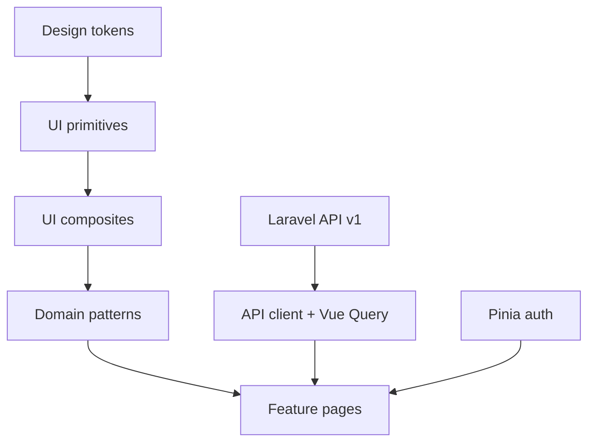

# Frontend Vue — especificação

Documento de referência para a UI da clínica. **Congela stack, pastas, design system e ordem de implementação.**

Código Vue **não** faz parte deste PR. Scaffold futuro: default sugerido `apps/web/` neste monorepo (alternativa: repo separado).

API consumida: Laravel Sanctum Bearer em `/api/v1/...` (ver [`stack-definition.md`](./stack-definition.md)).

---

## 1. Objetivos e restrições

### Objetivos

- App operacional para **médico** e **secretária** no dia a dia da clínica.
- **Mobile-first** (phone): desktop é enhancement da mesma UI, não desenho paralelo.
- Consistência visual via **design system próprio** — features só compõem componentes.
- Autenticação alinhada à API: token Sanctum `Authorization: Bearer …`.

### Restrições (v1 web)

| Inclui | Não inclui (ainda) |
| --- | --- |
| Web responsiva (Vite SPA) | PWA (manifest + service worker) |
| Design system + kitchen sink `/dev/ui` | Storybook (opcional depois; default é `/dev/ui`) |
| Fluxos clínicos principais | App nativo iOS/Android |
| PT-BR na UI | i18n multi-idioma |

### Fluxos críticos (phone)

1. Login / me / logout  
2. Busca de cliente  
3. Venda / orçamento  
4. Tratamento (abrir / concluir sessão)  
5. Estoque baixo + inbox de alertas  
6. Cards de métricas (ondas A–D)

---

## 2. Stack congelada

| Camada | Escolha | Notas |
| --- | --- | --- |
| Runtime | Vue **3** + **TypeScript** | Composition API + `<script setup>` |
| Bundler | **Vite** | SPA; sem SSR na v1 |
| Rotas | **Vue Router** | Guards por token |
| Estado cliente | **Pinia** | Auth session, shell UI |
| Estado servidor | **TanStack Query (Vue Query)** | Cache/invalidação da API |
| HTTP | **ofetch** (ou axios) | Interceptor Bearer + tratamento 401/403/422 |
| Forms | **VeeValidate + Zod** | Mapear erros `422` campo a campo |
| Estilo | **Tailwind CSS** | Mobile-first utilities |
| Headless UI | **Reka UI** (Radix Vue) | Primitives acessíveis; visual nosso |
| Ícones | Lucide (ou similar) | Um set só |
| PWA | **Depois** | `vite-plugin-pwa` na Fase 5 |

Auth: personal access token Sanctum já usado pelo backend. Cookie SPA auth fica como opção futura se o front e a API forem same-site.

---

## 3. Princípio: componentes antes das features

Ordem **obrigatória**:



1. **Tokens** — cores, tipografia, spacing, radii, z-index (CSS variables + Tailwind theme).
2. **Primitives** — Button, Input, Select, Textarea, Checkbox, Switch, Badge, Avatar, Spinner, Icon.
3. **Compostos** — FormField, Dialog/Sheet, Toast, Tabs, ListRow/Table, EmptyState, PageHeader, Skeleton, Banner.
4. **Patterns de domínio** — ClientSearchBar, MoneyInput/Display, StockStatusBadge, PermissionGate, ClinicShell.
5. **Páginas/features** — só depois do kitchen sink `/dev/ui` estar estável.

**Regra:** feature não monta HTML “cru” de controle; só importa `components/ui` e `components/patterns`.

Agentes Cursor: regra **always-on** em [`.cursor/rules/design-system.mdc`](../.cursor/rules/design-system.mdc); catálogo em [`.cursor/rules/vue-ui-components.mdc`](../.cursor/rules/vue-ui-components.mdc). Também em [`AGENTS.md`](../AGENTS.md).

---

## 4. Estrutura de pastas (alvo do scaffold)

```text
apps/web/                    # default no monorepo (ou repo separado com a mesma árvore src/)
  public/
  src/
    app/                     # App.vue, router, query client, providers
    assets/
    design-tokens/           # tokens.css + mapeamento Tailwind
    components/
      ui/                    # primitives + compostos genéricos
      patterns/              # padrões de domínio reutilizáveis
    features/                # slices por área (auth, clients, sales, …)
      auth/
      clients/
      products/
      sales/
      treatments/
      notifications/
      metrics/
    composables/
    lib/                     # api client, auth storage, formatters, permissions
    pages/                   # rotas thin → features
    stores/                  # Pinia (auth, ui)
    types/                   # espelhar API Resources Laravel
  .env.example               # VITE_API_URL=
  package.json
  vite.config.ts
  tailwind.config.ts
  README.md
```

### Regras de import

| De | Pode importar |
| --- | --- |
| `features/*` | `components/ui`, `components/patterns`, `lib`, `composables`, `stores`, `types` |
| `components/patterns` | `components/ui`, `lib`, `types` |
| `components/ui` | tokens, ícones — **não** features |
| `pages/*` | features (orquestração fina) |

Evitar: `components/ui` → `features` (ciclo e vazamento de domínio).

---

## 5. Design system — Soft Violet, Apple-minimal

**Nome:** Modern Soft Violet  
**Estilo:** Apple-minimal / Settings — grouped lists, hairline borders, violeta só como acento  

Referência visual: canvas `#F2F2F7`, superfícies brancas, pouca sombra, tipografia Inter. Sem cards pastéis, sem CTA gradient, sem sidebar “roxa sólida” como peça principal.

### 5.1 Tokens (CSS variables → Tailwind theme)

Implementar em `design-tokens/tokens.css` e mapear no `tailwind.config`.

#### Cores — brand

| Token | Hex | Uso |
| --- | --- | --- |
| `--color-brand-primary` | `#5956A6` | Sidebar, CTAs primários, links fortes |
| `--color-brand-primary-dark` | `#4A4791` | Pressed / active forte |
| `--color-brand-primary-light` | `#EEF0F7` | Hover leve, chips |
| `--color-brand-primary-hover` | `#4F4C96` | Hover de botão |

#### Cores — backgrounds

| Token | Hex | Uso |
| --- | --- | --- |
| `--color-bg-canvas` | `#F2F2F7` | Fundo grouped (iOS) |
| `--color-bg-sidebar` | `#1C1C1E` | Nav desktop (neutro; brand só no item ativo) |
| `--color-bg-surface` | `#FFFFFF` | Cards, sheets, dialogs |
| `--color-bg-surface-muted` | `#F2F2F7` | Search, secundário |
| `--color-bg-input` | `#F2F2F7` | Inputs |

#### Cores — texto

| Token | Hex | Uso |
| --- | --- | --- |
| `--color-text-title` | `#1C1C1E` | H1 / títulos |
| `--color-text-body` | `#3A3A3C` | Corpo |
| `--color-text-muted` | `#8E8E93` | Captions, hints, meta |
| `--color-text-inverse` | `#FFFFFF` | Texto sobre brand / sidebar |

#### Cores — accents / feedback

| Token | Hex | Uso |
| --- | --- | --- |
| `--color-success` | `#34C759` | Sucesso (switch on) |
| `--color-success-light` | `#E8F8ED` | Fundo sucesso |
| `--color-danger` | `#FF3B30` | Erros / destructive |
| `--color-danger-light` | `#FFECEA` | Fundo erro |
| `--color-warning` | `#FF9F0A` | Avisos de estoque |
| `--color-warning-light` | `#FFF4E5` | Fundo aviso |
| `--color-card-*` | `#F7F7F8` | Sem pastéis; lista grouped |
| `--color-badge-purple` | `#5956A6` | Badge de progresso |
| Gradient CTA | — | **Não usar** |

#### Cores — borders

| Token | Hex |
| --- | --- |
| `--color-border-subtle` | `rgba(60,60,67,0.12)` |
| `--color-border-divider` | `rgba(60,60,67,0.08)` |

#### Tipografia

| Token | Valor |
| --- | --- |
| Font family | `Inter Variable, -apple-system, BlinkMacSystemFont, system-ui` |
| H1 | 28px / 600 / 34px, tracking −0.03em |
| H2 | 17px / 600 / 22px |
| H3 | 15px / 500 / 20px |
| Body | 15px / 400 / 20px |
| Caption | 13px / 400 / 18px |
| Badge | 12px / 500, sentence case |

#### Radius / shadow / layout

| Token | Valor |
| --- | --- |
| Radius `sm` … `card` | 8 / 10 / 14 / 12 (+ `full`) |
| Shadow card | nenhuma — hairline |
| Shadow floating | `0 8px 28px rgba(0,0,0,0.12)` overlays |
| Shadow input | nenhuma |
| Sidebar width (desktop) | `240px` |
| Gap / padding página | `20px` / `24px` |

Motion: duração curta; respeitar `prefers-reduced-motion`.

### 5.2 Layout / shell

| Componente | Propósito | Estados | Breakpoints |
| --- | --- | --- | --- |
| `AppShell` / `ClinicShell` | Canvas `#F2F2F7` + nav | loading skeleton | **&lt; md:** tab bar clara; **≥ md:** sidebar `#1C1C1E` estreita |
| `SidebarNavItem` | Item de navegação | default / hover / active | Active: brand tint, peso 500 |
| `NavBadge` | Contagem (ex. inbox) | — | Pill, fundo `rgba(255,255,255,0.2)` |
| `Page` | Conteúdo principal | — | Padding 24; gap 20 entre blocos |
| `PageHeader` | H1 título + ações | — | Phone: título acima; ações empilham |
| `SearchField` | Busca global/página | — | Pill, bg `surfaceMuted`, ícone circular à direita |
| `IconButton` | Ações do header | hover soft | Ghost sobre canvas |
| `Stack` / `Inline` | Espaçamento | — | `Inline` → stack no xs |

**Sidebar desktop:** fundo neutro escuro (não violeta sólido). Sem ilustração no rodapé.

### 5.3 Surface / cards

Usar cards como **superfície operacional** (agrupar conteúdo), não como marketing.

| Componente | Spec |
| --- | --- |
| `SurfaceCard` | bg `#FFF`, radius 12, padding 20, hairline, sem shadow |
| `ListCard` | Linha grouped + chevron; sem pastéis |
| `MetaPair` | Par label/valor com ícone suave (detalhe de cliente, produto) |
| `PromoBanner` | **Não usar** na v1 clínica (reservado; design original tinha CTA gradient) |

### 5.4 Feedback

| Componente | Propósito | Estados |
| --- | --- | --- |
| `Toast` | Feedback temporário | success, error, info |
| `Banner` | Aviso persistente na página | info, warning, danger |
| `InlineAlert` | Erro/aviso junto ao form | — |
| `Skeleton` | Placeholder de loading | — |
| `EmptyState` | Lista vazia + CTA | — |
| `Spinner` | Loading pontual | sm / md |
| `Badge` | Status pill | success (verde claro), brand/purple, muted |

### 5.5 Forms

| Componente | Propósito | Estados / spec |
| --- | --- | --- |
| `Button` | primary / secondary / ghost / destructive | Primary: brand; hover `primaryHover`; loading / disabled |
| `ButtonAccent` | CTA raro (gradient pink→purple) | Só destaques explícitos |
| `Input` | Texto / number / password | bg `inputBackground`, radius ≥10, sombra inset opcional; invalid |
| `Textarea` | Texto longo | idem |
| `Select` | Escolha única (headless) | idem |
| `Checkbox` / `Switch` | Boolean | idem |
| `FormField` | Label + control + hint + **erro 422** | caption muted |
| `MoneyInput` / `MoneyDisplay` | BRL | parsing pt-BR |
| `MaskedBox` | Valor mascarado / read-only | bg `#F0F4F8`, radius 10, padding `10×14` |

Validação: Zod no client + exibir `errors.field` do Laravel `422`.

### 5.6 Overlay

| Componente | Propósito | Breakpoints |
| --- | --- | --- |
| `Sheet` | Painel lateral/bottom (surface branca, radius grande) | Preferir no phone |
| `Dialog` | Modal centrado | Preferir ≥ `md` |
| `ConfirmDialog` | Confirmação destrutiva | Ambos |

### 5.7 Data

| Componente | Propósito | Breakpoints |
| --- | --- | --- |
| `ListRow` / `ListCard` | Linha touch (título, meta, trailing / seta circular) | Default no phone |
| `TimelineList` | Lista com conector vertical (agenda / sessões) | Opcional em treatments |
| `Table` | Grade densa | ≥ `md`; no phone preferir `ListRow` |
| `FiltersBar` | Busca + filtros | Collapse em Sheet no phone |
| `Pagination` | Páginas da API | — |

### 5.8 Domain patterns

| Componente | Propósito |
| --- | --- |
| `PermissionGate` | Renderiza slot só se `/auth/me` tiver a permission Spatie |
| `ClientSearchBar` | Busca clientes (`?q=`) — usa `SearchField` |
| `StockStatusBadge` | Normal / low / reorder / negativo (success / warning / danger / purple) |
| `NotificationInboxItem` | Linha do inbox (`low_stock`, `projected_low_stock`, `reorder_point`, …) |
| `ClinicShell` | AppShell Soft Violet + nav filtrada por permissions |

### 5.9 Kitchen sink

Rota **`/dev/ui`** (protegida ou só em `import.meta.env.DEV`):

- Mostra tokens (swatches) + todos os primitives/compostos em todos os estados.
- Gate de qualidade **antes** de abrir PRs de features.
- Storybook fica opcional (fase 3.5); default é este sink.

---

## 6. Fundação técnica (antes das features)

### 6.1 API client (`lib/api`)

- Base URL: `import.meta.env.VITE_API_URL` (ex. `http://localhost:8080/api/v1`).
- Header `Authorization: Bearer <token>` quando autenticado.
- `Accept: application/json`.
- Em **401**: limpar sessão e redirecionar para login.
- Em **403**: toast/página “sem permissão”.
- Em **422**: lançar erro tipado `{ message, errors: Record<string, string[]> }` para VeeValidate.

### 6.2 Auth (`stores/auth` + `features/auth`)

- Endpoints: `POST /auth/login`, `POST /auth/register`, `GET /auth/me`, `POST /auth/logout` (e logout-all se útil).
- Persistir token (preferência: `sessionStorage` ou memória + refresh manual; evitar XSS óbvio com `localStorage` se possível — documentar trade-off no README do app).
- Guard de rota: sem token → login; com token → carregar `me` (permissions + clinic).

### 6.3 Permissions

- Fonte da verdade: lista de permissions no payload de `/auth/me` (Spatie).
- `PermissionGate` e guards de rota usam **permission name** (`products.view`, `metrics.view`, …), não role.

### 6.4 Vue Query

- Queries por recurso (`['clients', { q }]`, `['products', { low_stock: 1 }]`, …).
- Mutations invalidam queries relacionadas (ex. concluir appointment → products + notifications + metrics).

---

## 7. Passo a passo de implementação

### Fase 0 — Spec (este documento)

- [x] `docs/frontend-vue-spec.md`
- [x] Links em stack-definition + domain-roadmap

### Fase 1 — Scaffold

- [x] `apps/web` (Vite + Vue 3 + TS)
- [x] Tailwind 4, Vue Router, Pinia, Reka UI, Lucide
- [x] `.env.example` com `VITE_API_URL`
- [x] README em `apps/web/README.md`
- [x] Vue Query, VeeValidate, Zod, ofetch
- [ ] ESLint / Prettier (quando o fluxo de lint entrar)

**DoD Fase 1:** `npm run dev` abre o kitchen sink em `/dev/ui`.

### Fase 2 — Fundação app

- [x] `lib/api` + token em `sessionStorage`
- [x] Store Pinia `auth` (login / register / me / logout)
- [x] Rotas `/login` e `/` (`ClinicShell`)
- [x] Guards + 401 / 422
- [x] Tela login/cadastro (painel que desliza no desktop)

**DoD Fase 2:** login e cadastro reais contra Sanctum; `/auth/me` popula permissions.

### Fase 3 — Design system (“Modern Soft Violet”)

- [x] Tokens Soft Violet em CSS vars → Tailwind theme (§5.1)
- [x] `PageHeader` / `SearchField` + primitives de form/feedback/overlay no `/dev/ui`
- [x] Página `/dev/ui` com swatches + estados (default / erro / snack)
- [x] `ClinicShell` + `SidebarNavItem` (sidebar neutra; brand só como acento)
- [x] Patterns: `PermissionGate`, `ClientSearchBar`
- [ ] Patterns: `MoneyDisplay`, `StockStatusBadge`

**DoD Fase 3 (parcial):** kitchen sink revisável no visual Soft Violet; features de negócio ainda não.

### Fase 4 — Features (ordem de valor clínico)

Ordem acordada (UI). Protocolo ≠ agendamento ≠ tratamento (consumo).

| Ordem | Feature | Status |
| --- | --- | --- |
| 4.1 | Auth polish | feito |
| 4.2 | Clientes | feito |
| 4.2b | Equipe (RBAC) | feito |
| **4.3** | **Produtos** (+ marcas, tipos, unidades) | próximo — detalhe abaixo |
| **4.4** | **Protocolos** (pacote de produtos) | detalhe abaixo |
| **4.5** | **Vendas / orçamentos** | detalhe abaixo |
| **4.6** | **Agendamentos** (agenda completa) | detalhe abaixo — **depois** de vendas |
| **4.7** | **Tratamento — consumo clínico** (baixa estoque) | detalhe abaixo |
| **4.8** | **Métricas** | detalhe abaixo |
| 4.9 | Notificações | |

Cada feature: páginas mobile-first + `PermissionGate` nas ações.

**DoD Fase 4:** secretária e médico completam o fluxo diário no viewport phone.

#### 4.3 — Produtos (especificação de UI)

Objetivo: cadastro operacional do catálogo e estoque. API Phase 2 já existe; esta fase fecha a web e um ajuste de modelo para a cascata marca → tipo.

##### Decisões fechadas

| Tema | Decisão |
| --- | --- |
| Escopo | Lista + detalhe + criar/editar + desativar + **ajustar estoque**; CRUD de **marcas**, **tipos** e **unidades** na mesma fase |
| Cascata no form do produto | **Marca** → popula **tipos daquela marca** → preenche dados do produto (preços, estoque, unidade, etc.) |
| Lista — filtros | Switch “somente estoque baixo” + filtro por tipo + **busca `?q=`** (nome/SKU) — **API precisa ganhar `q`** |
| Lista — linha (`ListCard`) | Título = nome; meta = **tipo · marca · estoque**; badge estoque baixo quando `is_low_stock` |
| Form — campos | nome, marca, tipo, unidade, SKU, `purpose`, custo (criação / entrada), `sale_price`, `min_sale_price`, estoque inicial (criar), `min_stock`, `lead_time_days`, ativo |
| Estoque | Ação **Ajustar estoque**: `in`/`out`, qty, `unit_cost` obrigatório na entrada, motivo/notas |
| Desativar | DELETE soft (`is_active=false`); lista com filtro “somente ativos” (padrão ligado, como Clientes) |

##### Mudança de modelo / API (obrigatória nesta fase)

Hoje `product_type_id` e `brand_id` são FKs **independentes** em `products`. Para a cascata “tipos da marca”:

- [ ] `product_types.brand_id` (obrigatório, clinic-scoped) — tipo pertence a uma marca
- [ ] Migration + backfill dos tipos seedados (atribuir marca ou recriar seeds)
- [ ] `GET /product-types?brand_id=` para popular o select
- [ ] Validar no store/update de produto: `product_type.brand_id === product.brand_id`
- [ ] `GET /products?q=` busca por `name` / `sku` (além de `low_stock`, `product_type_id`, e opcional `is_active`)

Unidades de medida **continuam independentes** da marca (escolha no form do produto).

##### Telas / rotas

| Rota | Página | Permission |
| --- | --- | --- |
| `/products` | Lista (busca, low-stock, ativos, tipo) | `products.view` |
| `/products/new` | Criar produto | `products.create` |
| `/products/:id` | Detalhe + ações (editar, ajustar estoque, desativar) | `products.view` |
| `/products/:id/edit` | Editar | `products.update` |
| `/brands` | CRUD marcas | `brands.manage` |
| `/product-types` | CRUD tipos (sempre ligados a uma marca) | `product_types.manage` |
| `/units` | CRUD unidades | `units.manage` |

Nav: manter **Produtos**; catálogos podem ficar como subtela/atalhos no detalhe ou itens secundários na nav (decisão de chrome na implementação — preferir atalhos a partir da lista/form se a nav ficar pesada).

##### UX do formulário (produto)

1. Select **Marca** (ou criar marca se `brands.manage`).
2. Select **Tipo** filtrado por `brand_id` (ou criar tipo da marca se `product_types.manage`).
3. Demais campos: nome, SKU, unidade, purpose, preços, estoques, lead time, ativo.
4. Na **criação**, estoque inicial > 0 vira movimento `in` (já suportado pela API).
5. **Custo / quantidade de estoque** não editáveis no update direto — só via ajuste de estoque / criação.

##### Patterns de UI a reutilizar / acrescentar

- `ListCard`, `SearchField` / pattern de busca, `Switch` “somente ativos” / “estoque baixo”, `FormField`, `Select`, `Pagination`, `EmptyState`, `ConfirmDialog` (desativar).
- [ ] `MoneyDisplay` — preços e custo
- [ ] `StockStatusBadge` — baixo / ok (token success/warning)

##### DoD 4.3

- [ ] Secretária cadastra marca → tipo da marca → produto com unidade e preços
- [ ] Lista filtra por texto, tipo, estoque baixo e ativos
- [ ] Ajuste de estoque (entrada com custo recalcula média; saída sem mudar custo médio)
- [ ] Desativar produto e ocultar com “somente ativos”
- [ ] Outra clínica não vê o catálogo (já garantido na API; cobrir na UI só por escopo de sessão)
- [ ] Testes API da cascata marca/tipo + `?q=`; smoke manual das telas Vue

#### 4.4 — Protocolos (especificação de UI)

Objetivo: montar o **serviço completo** como pacote de produtos (custo/sugerido/mínimo/especial). Não baixa estoque. Pricing: [`protocolo.md`](./protocolo.md). API Phase 3 já existe.

##### Decisões fechadas

| Tema | Decisão |
| --- | --- |
| Escopo | Lista + detalhe + criar/editar + desativar + **itens no mesmo fluxo** (não tela separada de items) |
| Adicionar itens | Busca de produto (`?q=`) + quantidade; atalho **criar produto** se faltar no catálogo (`products.create`) |
| Preços no form | `total_cost` e `products_sale_total` **somente leitura** (calculados). `suggested_price`, `min_price`, `special_price` **todos editáveis**. Sem UI de flags manuais — ao salvar valor editado, a API marca `*_is_manual` |
| Lista — linha (`ListCard`) | Título = nome; meta/destaque = **valor sugerido** (`suggested_price`); badge **Inativo** se aplicável |
| Lista — filtros | Switch “somente ativos” (padrão ligado) + **busca `?q=`** por nome — **API precisa ganhar `q`** |
| Desativar | DELETE soft (`is_active=false`); filtro “somente ativos” |
| Nav | Item **Protocolos** no `ClinicShell` **e** atalho a partir de Produtos |

##### API / gaps nesta fase

- [ ] `GET /protocols?q=` (nome) + filtro `is_active` se ainda não exposto de forma clara na listagem
- CRUD / `PUT …/items` / `POST …/recalculate` já existem — UI pode chamar recalculate se quiser reset explícito depois; **v1 não exige** botão “Recalcular” (decisão 3C: edição direta marca manual)
- Itens: sync replace-all via `PUT /protocols/{id}/items` após editar a lista no form

##### Telas / rotas

| Rota | Página | Permission |
| --- | --- | --- |
| `/protocols` | Lista (busca, somente ativos) | `protocols.view` |
| `/protocols/new` | Criar (cabeçalho + itens + preços) | `protocols.create` |
| `/protocols/:id` | Detalhe (itens, preços, margens derivadas, ações) | `protocols.view` |
| `/protocols/:id/edit` | Editar mesmo fluxo do create | `protocols.update` |

Chrome: nav **Protocolos** (`protocols.view`); na lista/detalhe de **Produtos**, link “Ver protocolos” / “Novo protocolo” quando permitido.

##### UX do formulário (protocolo)

1. Nome + descrição (opcional) + ativo.
2. Bloco **Itens**: buscar produto → quantidade (UoM do produto) → adicionar linha; remover/editar qty; se não achar produto → atalho para `/products/new` (voltar com produto selecionável).
3. Bloco **Preços**:
   - leitura: custo total, soma preços de tabela, margens do Resource se úteis no detalhe;
   - edição: sugerido, mínimo, especial (opcional).
4. Salvar cabeçalho + sync de itens (create pode mandar `items` no POST; edit usa update + `PUT …/items` conforme API).

Fora de escopo 4.4: aplicar protocolo em venda (`POST /sales/{sale}/apply-protocol`) — fica em **4.5 Vendas**.

##### Patterns

- Reutilizar `ListCard`, busca, `Switch` ativos, `FormField`, `MoneyDisplay` (de 4.3), `Pagination`, `EmptyState`, `ConfirmDialog`.
- Pattern de **linhas de item** (produto + qty) — pode nascer em `components/patterns` se servir depois a vendas/tratamento.

##### DoD 4.4

- [ ] Secretária monta protocolo com ≥1 produto, vê sugerido na lista, edita sugerido/mín/especial
- [ ] Atalho criar produto a partir do form do protocolo
- [ ] Desativar + “somente ativos”; busca por nome
- [ ] Nav Protocolos + atalho em Produtos
- [ ] Testes API `?q=` (se novo); smoke Vue do fluxo create/edit/items

#### 4.5 — Vendas / orçamentos (especificação de UI)

Objetivo: fluxo comercial mobile-first — montar venda (protocolo + produtos), orçar, pagar e **confirmar sem baixar estoque**. Abrir tratamento / agenda ficam para **4.6+**. Pricing/estoque: [`domain-model.md`](./domain-model.md) §§8–10. API Phases 6–7 já existem.

##### Decisões fechadas

| Tema | Decisão |
| --- | --- |
| Escopo | Vendas **completas** (lista, draft, itens, pagamentos, confirm/cancel) **e** orçamentos (gerar / enviar / aceitar / rejeitar / expirar / **PDF**) |
| Fluxo mobile | **Wizard**: Cliente → Itens → Valores → Pagamentos → Revisar / Confirmar |
| Itens | Aplicar **protocolo** (explode/mescla) + produtos avulsos (busca) + editar qty/preço das linhas |
| Valor efetivo | Editável (manual); se &lt; mínimo → aviso + confirmação `confirm_below_minimum` (soft gate) |
| Pagamentos | Soma **deve fechar** o efetivo (sem parcial nesta fase); N métodos + meta de cartão quando `requires_card_meta` |
| Orçamentos | Timeline **dentro da venda**; criar só a partir de draft com itens |
| Lista vendas | Filtro **status** + busca cliente + chips de status no card |
| Card lista | **Cliente · status · valor efetivo · data** |
| Pós-confirmação | Ver / cancelar + link **Abrir tratamento** (API); sem PDF de contrato/recibo nesta fase |
| Nav | **Vendas** e **Orçamentos** |

##### Orçamentos × nav

- Criação e ações (send/accept/PDF) vivem no contexto da **venda** (`/sales/:id`, seção orçamentos).
- Item de nav **Orçamentos** = lista/inbox global (`GET /budgets`) que **abre a venda** (deep link) — não é um fluxo de create paralelo.

##### API / gaps nesta fase

- [ ] `GET /sales?q=` (nome/WhatsApp do cliente) e/ou entrada sempre via `client_id` + busca de clientes — **preferir `q` no index de sales** para a lista
- [ ] Filtros de lista já têm `status`, `client_id`; documentar uso na UI
- [ ] `GET /budgets` para nav Orçamentos (já existe: `sale_id`, `status`) — considerar `client_id` / ocultar `superseded` por default se faltar
- apply-protocol **mescla** quantidades: copy da UI = “Adicionar protocolo”, não “substituir pacote”
- `PUT …/items` e `PUT …/payments` = replace-all — o wizard mantém o array completo no client
- PDF orçamento: `POST /budgets/{id}/pdf` + `documents.generate`
- Confirm: `POST …/confirm` (+ `confirm_below_minimum` se preciso); **estoque inalterado**

##### Telas / rotas

| Rota | Página | Permission |
| --- | --- | --- |
| `/sales` | Lista (status, busca cliente, chips) | `sales.view` |
| `/sales/new` | Wizard create (passo cliente…) | `sales.create` |
| `/sales/:id` | Detalhe / retomar wizard se draft; orçamentos; ações | `sales.view` |
| `/sales/:id/edit` | Continuar draft (mesmos passos) | `sales.update` |
| `/budgets` | Inbox de orçamentos → deep link venda | `budgets.view` |

Passos do wizard (draft):

1. **Cliente** — busca (pattern `ClientSearchBar`); `client_id` imutável após create.
2. **Itens** — adicionar protocolo + produtos; editar qty/preços de linha; ver `expected_amount` / mínimos.
3. **Valores** — `effective_amount` editável; indicar se abaixo do mínimo.
4. **Pagamentos** — linhas método/valor (+ cartão); saldo até zerar.
5. **Revisar** — confirmar (dialog se below-min) ou caminho orçamento (gerar versão → enviar → PDF → aceitar/rejeitar).

Orçamento aceito: venda permanece `draft` para pagamentos/confirm (comportamento atual da API).

Confirmada: read-only (notas opcionais) + cancelar + **Abrir tratamento** (`treatments.start`) quando permitido — agenda de sessões no **4.6**.

##### Patterns

- Wizard / stepper (novo pattern mobile)
- Reutilizar linhas de item (4.4), `MoneyDisplay`, `Badge` status, `ClientSearchBar`, `ConfirmDialog`, `PermissionGate` por ação (`sales.confirm`, `budgets.convert`, `documents.generate`, …)

##### DoD 4.5

- [ ] Criar venda com protocolo + produto avulso, editar efetivo, pagar fechando o total, confirmar
- [ ] Soft confirm abaixo do mínimo
- [ ] Gerar orçamento, enviar, PDF, aceitar; depois confirmar venda
- [ ] Lista com status + busca cliente; card com cliente/status/efetivo/data
- [ ] Nav Vendas + Orçamentos (inbox)
- [ ] Pós-confirm: link abrir tratamento; estoque inalterado
- [ ] Testes API dos gaps (`q` se novo); smoke Vue do wizard

#### 4.6 — Agendamentos (especificação de UI)

Objetivo: **agenda completa da clínica** (dia/semana) — criar, remarcar, cancelar e **iniciar** sessão.  
**Não** inclui consumo de produtos nem baixa de estoque (isso é **4.7**).  
Pré-requisito de domínio: tratamento aberto a partir de **venda confirmada** → por isso esta fase vem **depois** de **4.5 Vendas / orçamentos**.

##### Decisões fechadas

| Tema | Decisão |
| --- | --- |
| Escopo visual | Agenda completa (visões **dia** e **semana**) |
| Ordem no roadmap | Agendamento **depois** de orçamento/venda (não antes) |
| Listagem API | Novo `GET /appointments?from=&to=&status=&professional_user_id=&client_id=` (visão clínica; não só nested no treatment) |
| Permissões | **Novas** `appointments.*` (não reutilizar só `treatments.*` para agenda) |
| Profissional | **Obrigatório** em create/update; validar **conflito de horário** do mesmo profissional |
| Ações nesta fase | Criar, remarcar (patch enquanto `scheduled`), cancelar, **iniciar** (`start` → `in_progress`, avisos de estoque não bloqueantes) |
| Fora desta fase | Sync de consumptions + `complete` (estoque) → **4.7** |
| Card / evento | Cliente, data/hora, status (chip), profissional, link do tratamento |
| Nav | Item **Agenda** (`/appointments` ou `/agenda`) — não depende de nav de Tratamentos |

##### Permissões novas (API + seed + roles)

| Permission | Uso |
| --- | --- |
| `appointments.view` | Ver agenda e detalhe da sessão |
| `appointments.manage` | Criar / remarcar sessão |
| `appointments.start` | Iniciar atendimento (`in_progress`) |
| `appointments.cancel` | Cancelar sessão (`scheduled` / `in_progress`) |

Atribuição sugerida na seed (ajustável):

- **receptionist**: `view` + `manage` + `cancel` (+ `start` se a recepção inicia o check-in)
- **professional**: `view` + `manage` + `start` + `cancel`
- **admin**: todas

Abrir tratamento a partir da venda continua em `treatments.start` (fluxo comercial/clínico em 4.5/4.7) — agenda só agenda sessões de tratamento **já aberto**.

##### API / modelo (gaps nesta fase)

- [ ] `GET /appointments` com `from`, `to`, `status`, `professional_user_id`, `client_id` (paginação ou janela de calendário)
- [ ] `professional_user_id` **required** no store/update (hoje nullable)
- [ ] Validação de **overlap**: mesmo `professional_user_id`, status `scheduled` ou `in_progress`, intervalos que se cruzam → 422 (definir duração padrão se só houver `scheduled_at` pontual — ex. usar `client.service_duration_minutes` ou duração default da clínica / campo futuro `duration_minutes` planejado)
- [ ] Endpoints de create/patch/start/cancel passam a checar `appointments.*` (ou dual-check documentado na implementação)
- Nested `GET/POST treatments/{id}/appointments` pode permanecer para detalhe do caso; a **Agenda** usa o index global

##### Telas / rotas

| Rota | Página | Permission |
| --- | --- | --- |
| `/appointments` (ou `/agenda`) | Calendário dia/semana + filtros | `appointments.view` |
| `/appointments/new` | Nova sessão (tratamento + profissional + data/hora + notas) | `appointments.manage` |
| `/appointments/:id` | Detalhe + remarcar / cancelar / iniciar | `appointments.view` |

Mobile-first: no phone, default **dia**; semana como progressive enhancement (`md:`).

##### UX

1. Abrir Agenda → ver slots do dia/semana por profissional (ou grade única com cor/profissional).
2. Nova sessão: escolher **tratamento aberto** (cliente vem do tratamento) → **profissional** → data/hora → notas.
3. Conflito de horário do profissional → erro claro no form (422).
4. Iniciar: confirma check-in; status `in_progress`; pode mostrar warning de estoque **sem** bloquear; **não** abre tela de consumo (link “Registrar consumo” só quando 4.7 existir).
5. Cancelar: `ConfirmDialog`; sem efeito em estoque.

##### Patterns

- Calendário / grade de agenda (novo pattern — evitar inventar fora de `components/ui` + `patterns`)
- `Badge` de status (`scheduled` / `in_progress` / `completed` / `cancelled`)
- `ListCard` ou eventos na grade; `ConfirmDialog`; `FormField` + `Select` de profissional (usuários da clínica com papel profissional / permissão adequada)

##### DoD 4.6

- [ ] Agenda dia/semana lista sessões da clínica via `GET /appointments`
- [ ] Criar sessão com profissional obrigatório; overlap rejeitado
- [ ] Remarcar / cancelar / iniciar sem baixar estoque
- [ ] Card mostra cliente, horário, status, profissional, link tratamento
- [ ] Nav **Agenda**; permissões `appointments.*` no seed e `PermissionGate`
- [ ] Testes API (index, overlap, perms); smoke Vue do calendário

#### 4.7 — Tratamento / consumo clínico (especificação de UI)

Objetivo: registrar o que foi **realmente usado** na sessão e **completar o appointment** → snapshot de custo + **baixa de estoque**.  
Agenda (calendário, remarcar, overlap) fica no **4.6**. Aqui entra o checklist de consumo + fechar o caso clínico.

##### Decisões fechadas

| Tema | Decisão |
| --- | --- |
| Escopo | Lista de tratamentos + detalhe (fulfillment + sessões) + tela de **consumo** da sessão + completar/cancelar sessão e tratamento |
| Entrada no dia a dia | Principal pela **Agenda** (sessão `in_progress` → consumir); `/treatments` como apoio |
| Qtys sugeridas | Pré-preenche com **saldo restante** da venda; profissional **ajusta** antes de concluir |
| Extras | Cortesia **e** cobrado (pagamento na hora, como a API — `SalePayment` na venda) |
| Estoque baixo no start | Banner **não bloqueante** (API); conclusão **não** bloqueia estoque negativo |
| Sessão sem produtos | Permitido — “Concluir sem produtos” (avaliação) |
| Lista | Filtro **status** + busca cliente (`?q=` / `client_id`); card: **cliente · status · venda · custo total** |
| Nav | **Tratamentos** **e** links a partir de Agenda / Venda confirmada |
| Permissões | Nova **`treatments.consume`** para sync de consumptions (+ complete de sessão usa `treatments.complete` como hoje, ou exige `consume` — ver abaixo) |

##### Fronteira 4.6 × 4.7

| 4.6 Agenda | 4.7 Consumo |
| --- | --- |
| Criar / remarcar / cancelar / **iniciar** | Tela de linhas de consumo |
| `appointments.*` | `treatments.view` + **`treatments.consume`** + `treatments.complete` / `cancel` |
| Sem baixa de estoque | Estoque só no **complete** da sessão |

Após **iniciar** na Agenda: CTA “Registrar consumo” → `/appointments/:id/consume` (ou `/treatments/:id/sessions/:appointmentId`).

##### Permissões (ajuste nesta fase)

| Permission | Uso |
| --- | --- |
| `treatments.view` | Lista/detalhe/fulfillment |
| `treatments.start` | Abrir tratamento da venda (já em 4.5 pós-confirm) |
| **`treatments.consume`** | **Nova** — `PUT …/consumptions` (sugerido + extras) |
| `treatments.complete` | Completar appointment (estoque) e/ou fechar treatment |
| `treatments.cancel` | Cancelar appointment/treatment (regras atuais da API) |
| `treatments.manage` | Manter para ajustes estruturais se ainda necessário; **preferir `consume` na UI de sessão** |

Seed sugerido: **professional** e **admin** com `consume` + `complete`; recepção sem `consume` (só agenda), salvo decisão operacional.

##### API / gaps

- [ ] Seed + middleware: `treatments.consume` no `PUT …/consumptions` (hoje é `treatments.manage`)
- [ ] `GET /treatments?q=` (cliente) além de `status`, `client_id`, `sale_id`
- Fluxo já existe: open from sale → start → suggested remaining → PUT consumptions → complete (stock out `allowNegative`)
- Fulfillment: `GET …/fulfillment` no detalhe do tratamento
- Cancel appointment `in_progress`: remove consumptions draft + pagamentos extra; **sem** estorno de estoque de sessões já completed (fase posterior)

##### Telas / rotas

| Rota | Página | Permission |
| --- | --- | --- |
| `/treatments` | Lista (status, busca cliente) | `treatments.view` |
| `/treatments/:id` | Detalhe: fulfillment, sessões, abrir consumo, completar/cancelar caso | `treatments.view` |
| `/appointments/:id/consume` (ou nested) | Checklist de consumo da sessão `in_progress` | `treatments.consume` |
| Deep links | Venda confirmada → abrir tratamento; Agenda → consumir | conforme ação |

##### UX da tela de consumo

1. Entrar com sessão `in_progress` (via Agenda ou detalhe).
2. Banner de `stock_warning` se houver (não bloqueia).
3. Linhas **sugeridas** pré-preenchidas com saldo restante — editar qty / zerar.
4. Adicionar **extra**: cortesia ou cobrado (+ método/valor de pagamento se cobrado).
5. Salvar sync (`PUT consumptions`) e/ou **Concluir sessão** (`complete`) → estoque desce; mostrar custo da sessão.
6. Opção **Concluir sem produtos**.
7. No tratamento: quando não houver sessão ativa e saldo ok, **completar tratamento**; cancelar tratamento só se nenhuma sessão completed (regra API).

##### Patterns

- Reutilizar linhas de item (4.4/4.5), `MoneyDisplay`, `Badge`, `Banner`/`InlineAlert` para stock warning, `ConfirmDialog`, pagamentos (subset do wizard de venda para extra cobrado).

##### DoD 4.7

- [ ] Lista tratamentos com status + busca; card cliente/status/venda/custo
- [ ] Consumo a partir da Agenda; sugeridos ajustáveis; extras cortesia e cobrado
- [ ] Completar sessão baixa estoque; concluir sem produtos ok; warning não bloqueia
- [ ] Nav Tratamentos + links Agenda/Venda
- [ ] `treatments.consume` no seed e nas rotas de sync
- [ ] Testes API da nova perm + smoke Vue do fluxo start→consume→complete

#### 4.8 — Métricas (especificação de UI)

Objetivo: dashboard mobile-first com as **4 waves** de KPI já expostas na API. Guia: [`metrics-kpis-roadmap.md`](./metrics-kpis-roadmap.md). Permission: `metrics.view`.

##### Decisões fechadas

| Tema | Decisão |
| --- | --- |
| Escopo | Waves **A–D** na UI (comercial, aquisição, margem, estoque/ops) |
| Layout | **Uma página** `/metrics` com seções empilhadas + seletor de período no topo |
| Período padrão | **Mês corrente** (+ atalhos recomendados: 7d / 30d / mês / custom `from`–`to`) |
| Gráficos | Charts onde a API tiver série / ranking visual — no mínimo série de receita (A); demais waves com visualização adequada aos dados (não só números soltos) |
| Acima da dobra | **Faturamento** (receita), **ticket médio**, **taxa de conversão** (aquisição), **margem** |
| Aquisição | Toggle **origem / campanha** (`group_by`) |
| Margem | Toggle **período / cohort_sale** (`mode`) |
| Estoque / ops | **Seção na mesma página** (low-stock + sessões + pendências de fulfillment) — não só deep links |
| Quem vê | Só quem tem `metrics.view` — **manter admin** (seed atual) |
| Nav | Item **Métricas** |

##### Conteúdo por seção (mesma rota)

1. **Período** — default mês corrente; envia `from`/`to` a todos os GETs (inventory pode usar o mesmo range).
2. **Primeiro viewport (cards)** — faturamento · ticket médio · taxa conversão · margem (puxar de `commercial` + `acquisition` + `margin`).
3. **Comercial (A)** — resto dos KPIs (nº vendas, desconto médio, funil orçamento, mix pagamento) + **série/chart de receita** (`granularity` auto ou escolhida).
4. **Aquisição (B)** — ranking com toggle origem/campanha; conversão em destaque (já no hero).
5. **Margem (C)** — KPIs + toggle período/cohort; nota de fulfillment pendente no modo cohort.
6. **Estoque & operações (D)** — cards low-stock / valor estoque / sessões / cancelamentos; listas curtas (low-stock products, pending fulfillments, by_professional) com link para Produtos / Tratamentos / Agenda quando fizer sentido.

Uma seção = um job; evitar “dashboard denso” no primeiro viewport (só os 4 cards + período).

##### API (já existe — gaps só de UX)

| Endpoint | Uso na página |
| --- | --- |
| `GET /metrics/commercial` | Hero receita/ticket; seção A + series |
| `GET /metrics/acquisition` | Hero conversão; seção B |
| `GET /metrics/margin` | Hero margem; seção C |
| `GET /metrics/inventory` | Seção D estoque |
| `GET /metrics/operations` | Seção D ops |

Clinic scope = sessão atual. Sem multi-clínica no picker.

##### Telas / rotas

| Rota | Página | Permission |
| --- | --- | --- |
| `/metrics` | Dashboard único (seções A–D) | `metrics.view` |

Não obrigatório criar sub-rotas nesta fase (decisão 2A).

##### Patterns

- [ ] `MetricCard` (ou pattern) — valor + label + opcional delta
- [ ] Chart simples (série receita) — lib leve alinhada ao design system; tokens Soft Violet
- `PageHeader`, filtros de período, `Badge`/`ListCard` para listas D, `PermissionGate` / route meta
- `MoneyDisplay` para valores

##### DoD 4.8

- [ ] `/metrics` com período mês corrente e 4 cards do hero
- [ ] Seções A–D consumindo os 5 endpoints; toggles aquisição e margem
- [ ] Chart(s) conforme decisão C (no mínimo receita no tempo)
- [ ] Estoque/ops com listas na página + links
- [ ] Nav Métricas; só `metrics.view` (admin)
- [ ] Smoke: números batem com fixture conhecida do período

### Fase 5 — PWA (depois da web estável)

1. `vite-plugin-pwa` (manifest, ícones, service worker).
2. Offline mínimo: shell + fila opcional (não bloquear v1).
3. Install / “Add to Home Screen”.
4. Atualizar roadmap Phase 11 checkboxes de PWA.

**Fora da v1 web:** push nativo, sync offline completo, app stores.

---

## 8. Convenções

- **Mobile-first:** estilos base = phone; `md:` / `lg:` enriquecem.
- **Um job por tela/seção:** evitar dashboards densos no primeiro viewport.
- **Tipos:** nomes alinhados aos API Resources Laravel (`Client`, `Product`, `Sale`, …).
- **Datas:** ISO na API; exibir pt-BR na UI.
- **Dinheiro:** strings decimais da API; formatar só na borda de UI.
- **Acessibilidade:** focus ring visível; labels em todo FormField; overlays com focus trap (headless).
- **Não** usar role name para autorizar UI.

---

## 9. Mapa inicial de rotas

| Rota | Página | Permission (exemplo) |
| --- | --- | --- |
| `/login` | Login | guest |
| `/` | Home / atalhos | auth |
| `/clients` | Lista/busca | `clients.view` |
| `/clients/:id` | Detalhe | `clients.view` |
| `/users` | Equipe | `users.view` |
| `/products` | Catálogo | `products.view` |
| `/brands` | Marcas | `brands.manage` |
| `/product-types` | Tipos de produto | `product_types.manage` |
| `/units` | Unidades | `units.manage` |
| `/protocols` | Protocolos | `protocols.view` |
| `/sales` | Vendas | `sales.view` |
| `/budgets` | Orçamentos (inbox) | `budgets.view` |
| `/appointments` | Agenda | `appointments.view` |
| `/treatments` | Tratamentos (consumo) | `treatments.view` |
| `/appointments/:id/consume` | Consumo da sessão | `treatments.consume` |
| `/notifications` | Inbox | auth |
| `/metrics` | Dashboard KPIs | `metrics.view` |
| `/dev/ui` | Kitchen sink | DEV ou admin |

Nav do `ClinicShell` só mostra itens permitidos.

---

## 10. Fora de escopo deste documento / v1 web

- Features clínicas e auth (Fases 2 e 4)
- PWA / service worker
- Storybook (opcional)
- Temas dark mode como prioridade
- App nativo
- Substituição do PushChannel stub por FCM (backend)

---

## 11. Referências

- API / auth: [`stack-definition.md`](./stack-definition.md)
- Domínio e fases: [`domain-roadmap.md`](./domain-roadmap.md), [`domain-model.md`](./domain-model.md)
- Métricas: [`metrics-kpis-roadmap.md`](./metrics-kpis-roadmap.md)
- Visão produto: [`visao-da-plataforma.md`](./visao-da-plataforma.md)
