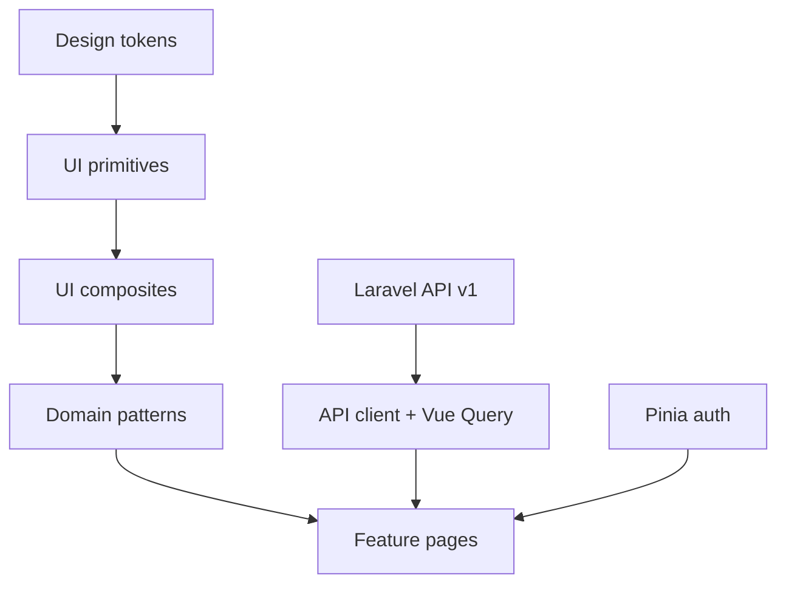

# Frontend Vue — especificação

Documento de referência para a UI da clínica. **Congela stack, pastas, design system e ordem de implementação.**

Código Vue **não** faz parte deste PR. Scaffold futuro: default sugerido `apps/web/` neste monorepo (alternativa: repo separado).

API consumida: Laravel Sanctum Bearer em `/api/v1/...` (ver [`stack-definition.md`](./stack-definition.md)).

---

## 1. Objetivos e restrições

### Objetivos

- App operacional para **médico** e **secretária** no dia a dia da clínica.
- **Mobile-first** (phone): desktop é enhancement da mesma UI, não desenho paralelo.
- Consistência visual via **design system próprio** — features só compõem componentes.
- Autenticação alinhada à API: token Sanctum `Authorization: Bearer …`.

### Restrições (v1 web)

| Inclui | Não inclui (ainda) |
| --- | --- |
| Web responsiva (Vite SPA) | PWA (manifest + service worker) |
| Design system + kitchen sink `/dev/ui` | Storybook (opcional depois; default é `/dev/ui`) |
| Fluxos clínicos principais | App nativo iOS/Android |
| PT-BR na UI | i18n multi-idioma |

### Fluxos críticos (phone)

1. Login / me / logout  
2. Busca de cliente  
3. Venda / orçamento  
4. Tratamento (abrir / concluir sessão)  
5. Estoque baixo + inbox de alertas  
6. Cards de métricas (ondas A–D)

---

## 2. Stack congelada

| Camada | Escolha | Notas |
| --- | --- | --- |
| Runtime | Vue **3** + **TypeScript** | Composition API + `<script setup>` |
| Bundler | **Vite** | SPA; sem SSR na v1 |
| Rotas | **Vue Router** | Guards por token |
| Estado cliente | **Pinia** | Auth session, shell UI |
| Estado servidor | **TanStack Query (Vue Query)** | Cache/invalidação da API |
| HTTP | **ofetch** (ou axios) | Interceptor Bearer + tratamento 401/403/422 |
| Forms | **VeeValidate + Zod** | Mapear erros `422` campo a campo |
| Estilo | **Tailwind CSS** | Mobile-first utilities |
| Headless UI | **Reka UI** (Radix Vue) | Primitives acessíveis; visual nosso |
| Ícones | Lucide (ou similar) | Um set só |
| PWA | **Depois** | `vite-plugin-pwa` na Fase 5 |

Auth: personal access token Sanctum já usado pelo backend. Cookie SPA auth fica como opção futura se o front e a API forem same-site.

---

## 3. Princípio: componentes antes das features

Ordem **obrigatória**:



1. **Tokens** — cores, tipografia, spacing, radii, z-index (CSS variables + Tailwind theme).
2. **Primitives** — Button, Input, Select, Textarea, Checkbox, Switch, Badge, Avatar, Spinner, Icon.
3. **Compostos** — FormField, Dialog/Sheet, Toast, Tabs, ListRow/Table, EmptyState, PageHeader, Skeleton, Banner.
4. **Patterns de domínio** — ClientSearchBar, MoneyInput/Display, StockStatusBadge, PermissionGate, ClinicShell.
5. **Páginas/features** — só depois do kitchen sink `/dev/ui` estar estável.

**Regra:** feature não monta HTML “cru” de controle; só importa `components/ui` e `components/patterns`.

---

## 4. Estrutura de pastas (alvo do scaffold)

```text
apps/web/                    # default no monorepo (ou repo separado com a mesma árvore src/)
  public/
  src/
    app/                     # App.vue, router, query client, providers
    assets/
    design-tokens/           # tokens.css + mapeamento Tailwind
    components/
      ui/                    # primitives + compostos genéricos
      patterns/              # padrões de domínio reutilizáveis
    features/                # slices por área (auth, clients, sales, …)
      auth/
      clients/
      products/
      sales/
      treatments/
      notifications/
      metrics/
    composables/
    lib/                     # api client, auth storage, formatters, permissions
    pages/                   # rotas thin → features
    stores/                  # Pinia (auth, ui)
    types/                   # espelhar API Resources Laravel
  .env.example               # VITE_API_URL=
  package.json
  vite.config.ts
  tailwind.config.ts
  README.md
```

### Regras de import

| De | Pode importar |
| --- | --- |
| `features/*` | `components/ui`, `components/patterns`, `lib`, `composables`, `stores`, `types` |
| `components/patterns` | `components/ui`, `lib`, `types` |
| `components/ui` | tokens, ícones — **não** features |
| `pages/*` | features (orquestração fina) |

Evitar: `components/ui` → `features` (ciclo e vazamento de domínio).

---

## 5. Design system — checklist v1

Cada item: **propósito**, **estados**, **notas de breakpoint**. Sem implementação neste doc.

### 5.1 Tokens

| Token group | Propósito |
| --- | --- |
| Color | Background, surface, text, border, primary, danger, warning, success, muted |
| Typography | `font-sans`, escalas `text-xs`…`text-2xl`, pesos |
| Spacing | Escala Tailwind padrão (4px base) |
| Radius | `sm` / `md` / `lg` (consistente; sem “pill” em tudo) |
| Shadow | Poucos níveis; preferir border + surface |
| Motion | Duração curta; respeitar `prefers-reduced-motion` |

App interno: listas e formulários — **não** hero marketing com cards decorativos.

### 5.2 Layout

| Componente | Propósito | Estados | Breakpoints |
| --- | --- | --- | --- |
| `AppShell` | Frame da app autenticada | loading (skeleton nav) | Bottom nav &lt; `md`; side nav ≥ `md` |
| `Page` | Padding + max-width do conteúdo | — | Full bleed phone; constrain desktop |
| `Stack` / `Inline` | Espaçamento vertical / horizontal | — | `Inline` pode virar stack no xs |
| `PageHeader` | Título + ações | actions slot | Ações empilham no phone |

### 5.3 Feedback

| Componente | Propósito | Estados |
| --- | --- | --- |
| `Toast` | Feedback temporário (sucesso/erro) | success, error, info |
| `Banner` | Aviso persistente na página | info, warning, danger |
| `InlineAlert` | Erro/aviso junto ao form | — |
| `Skeleton` | Placeholder de loading | — |
| `EmptyState` | Lista vazia + CTA | — |
| `Spinner` | Loading pontual | sm / md |

### 5.4 Forms

| Componente | Propósito | Estados |
| --- | --- | --- |
| `Button` | Ação primária/secundária/destructive | default, loading, disabled |
| `Input` | Texto / number / password | default, disabled, invalid |
| `Textarea` | Texto longo | idem |
| `Select` | Escolha única (headless) | idem |
| `Checkbox` / `Switch` | Boolean | idem |
| `FormField` | Label + control + hint + **erro 422** | error message from API |
| `MoneyInput` / `MoneyDisplay` | BRL | parsing pt-BR |

Validação: Zod no client + exibir `errors.field` do Laravel `422`.

### 5.5 Overlay

| Componente | Propósito | Breakpoints |
| --- | --- | --- |
| `Sheet` | Painel lateral/bottom para detalhes e forms | Preferir no phone |
| `Dialog` | Modal centrado | Preferir ≥ `md` |
| `ConfirmDialog` | Confirmação destrutiva | Ambos |

### 5.6 Data

| Componente | Propósito | Breakpoints |
| --- | --- | --- |
| `ListRow` | Linha touch (título, meta, trailing) | Default no phone |
| `Table` | Grade densa | ≥ `md`; no phone preferir `ListRow` |
| `FiltersBar` | Busca + filtros | Collapse em Sheet no phone |
| `Pagination` | Páginas da API | — |

### 5.7 Domain patterns

| Componente | Propósito |
| --- | --- |
| `PermissionGate` | Renderiza slot só se `/auth/me` tiver a permission Spatie |
| `ClientSearchBar` | Busca clientes (`?q=`) |
| `StockStatusBadge` | Normal / low / reorder / negativo |
| `NotificationInboxItem` | Linha do inbox (`low_stock`, `projected_low_stock`, `reorder_point`, …) |
| `ClinicShell` | AppShell + nav filtrada por permissions |

### 5.8 Kitchen sink

Rota **`/dev/ui`** (protegida ou só em `import.meta.env.DEV`):

- Mostra todos os primitives/compostos em todos os estados.
- Gate de qualidade **antes** de abrir PRs de features.
- Storybook fica opcional (fase 3.5); default é este sink.

---

## 6. Fundação técnica (antes das features)

### 6.1 API client (`lib/api`)

- Base URL: `import.meta.env.VITE_API_URL` (ex. `http://localhost:8080/api/v1`).
- Header `Authorization: Bearer <token>` quando autenticado.
- `Accept: application/json`.
- Em **401**: limpar sessão e redirecionar para login.
- Em **403**: toast/página “sem permissão”.
- Em **422**: lançar erro tipado `{ message, errors: Record<string, string[]> }` para VeeValidate.

### 6.2 Auth (`stores/auth` + `features/auth`)

- Endpoints: `POST /auth/login`, `GET /auth/me`, `POST /auth/logout` (e logout-all se útil).
- Persistir token (preferência: `sessionStorage` ou memória + refresh manual; evitar XSS óbvio com `localStorage` se possível — documentar trade-off no README do app).
- Guard de rota: sem token → login; com token → carregar `me` (permissions + clinic).

### 6.3 Permissions

- Fonte da verdade: lista de permissions no payload de `/auth/me` (Spatie).
- `PermissionGate` e guards de rota usam **permission name** (`products.view`, `metrics.view`, …), não role.

### 6.4 Vue Query

- Queries por recurso (`['clients', { q }]`, `['products', { low_stock: 1 }]`, …).
- Mutations invalidam queries relacionadas (ex. concluir appointment → products + notifications + metrics).

---

## 7. Passo a passo de implementação

### Fase 0 — Spec (este documento)

- [x] `docs/frontend-vue-spec.md`
- [x] Links em stack-definition + domain-roadmap

### Fase 1 — Scaffold (PR futuro de código)

1. Criar `apps/web` com `npm create vite@latest` (Vue + TS).
2. Configurar Tailwind, ESLint, Prettier, Vue Router, Pinia, Vue Query, VeeValidate, Zod, ofetch, Reka UI, Lucide.
3. `.env.example` com `VITE_API_URL`.
4. Proxy Vite → API local (Docker) se útil.
5. README: como subir API + front.

**DoD Fase 1:** `npm run dev` abre shell vazio apontando para a API.

### Fase 2 — Fundação app

1. `lib/api` + storage de token.
2. Store Pinia `auth` (login / me / logout).
3. Rotas `/login` e `/` (shell).
4. Guards + tratamento 401/403/422.
5. `AppShell` placeholder (sem nav completa).

**DoD Fase 2:** login real contra Sanctum; `/auth/me` popula permissions.

### Fase 3 — Design system

1. Tokens no Tailwind theme.
2. Primitives (lista §5.2–5.4).
3. Compostos (FormField, Sheet/Dialog, Toast, ListRow/Table, EmptyState, PageHeader).
4. Página `/dev/ui` com todos os estados.
5. Patterns iniciais: `PermissionGate`, `MoneyDisplay`, `StockStatusBadge`.

**DoD Fase 3:** kitchen sink revisável; nenhuma feature de negócio ainda (exceto auth já feita).

### Fase 4 — Features (ordem de valor clínico)

| Ordem | Feature | API / notas |
| --- | --- | --- |
| 4.1 | Auth polish | Lembrar clinic name, erros de login |
| 4.2 | Clientes | CRUD + busca `?q=` |
| 4.3 | Produtos | Lista, filtro low-stock, `lead_time_days` no form |
| 4.4 | Vendas / orçamentos | Fluxos principais confirm/cancel; sem baixar estoque na confirmação |
| 4.5 | Tratamentos / appointments | Start/complete, warnings de estoque, fulfillment |
| 4.6 | Notificações | Inbox list/read/read-all |
| 4.7 | Métricas | Cards A–D (`/metrics/commercial`, `acquisition`, `margin`, `inventory`, `operations`) |

Cada feature: páginas mobile-first + `PermissionGate` nas ações.

**DoD Fase 4:** secretária e médico completam o fluxo diário no viewport phone.

### Fase 5 — PWA (depois da web estável)

1. `vite-plugin-pwa` (manifest, ícones, service worker).
2. Offline mínimo: shell + fila opcional (não bloquear v1).
3. Install / “Add to Home Screen”.
4. Atualizar roadmap Phase 11 checkboxes de PWA.

**Fora da v1 web:** push nativo, sync offline completo, app stores.

---

## 8. Convenções

- **Mobile-first:** estilos base = phone; `md:` / `lg:` enriquecem.
- **Um job por tela/seção:** evitar dashboards densos no primeiro viewport.
- **Tipos:** nomes alinhados aos API Resources Laravel (`Client`, `Product`, `Sale`, …).
- **Datas:** ISO na API; exibir pt-BR na UI.
- **Dinheiro:** strings decimais da API; formatar só na borda de UI.
- **Acessibilidade:** focus ring visível; labels em todo FormField; overlays com focus trap (headless).
- **Não** usar role name para autorizar UI.

---

## 9. Mapa inicial de rotas

| Rota | Página | Permission (exemplo) |
| --- | --- | --- |
| `/login` | Login | guest |
| `/` | Home / atalhos | auth |
| `/clients` | Lista/busca | `clients.view` |
| `/clients/:id` | Detalhe | `clients.view` |
| `/products` | Catálogo | `products.view` |
| `/sales` | Vendas | `sales.view` |
| `/treatments` | Tratamentos | `treatments.view` |
| `/notifications` | Inbox | auth |
| `/metrics` | Dashboard KPIs | `metrics.view` |
| `/dev/ui` | Kitchen sink | DEV ou admin |

Nav do `ClinicShell` só mostra itens permitidos.

---

## 10. Fora de escopo deste documento / v1 web

- Implementação do código Vue (Fases 1+)
- PWA / service worker
- Storybook (opcional)
- Temas dark mode como prioridade
- App nativo
- Substituição do PushChannel stub por FCM (backend)

---

## 11. Referências

- API / auth: [`stack-definition.md`](./stack-definition.md)
- Domínio e fases: [`domain-roadmap.md`](./domain-roadmap.md), [`domain-model.md`](./domain-model.md)
- Métricas: [`metrics-kpis-roadmap.md`](./metrics-kpis-roadmap.md)
- Visão produto: [`visao-da-plataforma.md`](./visao-da-plataforma.md)
