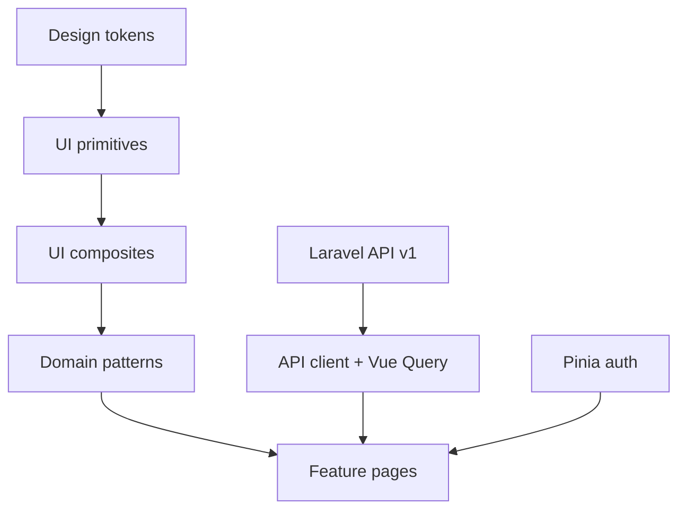

# Frontend Vue — especificação

Documento de referência para a UI da clínica. **Congela stack, pastas, design system e ordem de implementação.**

Código Vue **não** faz parte deste PR. Scaffold futuro: default sugerido `apps/web/` neste monorepo (alternativa: repo separado).

API consumida: Laravel Sanctum Bearer em `/api/v1/...` (ver [`stack-definition.md`](./stack-definition.md)).

---

## 1. Objetivos e restrições

### Objetivos

- App operacional para **médico** e **secretária** no dia a dia da clínica.
- **Mobile-first** (phone): desktop é enhancement da mesma UI, não desenho paralelo.
- Consistência visual via **design system próprio** — features só compõem componentes.
- Autenticação alinhada à API: token Sanctum `Authorization: Bearer …`.

### Restrições (v1 web)

| Inclui | Não inclui (ainda) |
| --- | --- |
| Web responsiva (Vite SPA) | PWA (manifest + service worker) |
| Design system + kitchen sink `/dev/ui` | Storybook (opcional depois; default é `/dev/ui`) |
| Fluxos clínicos principais | App nativo iOS/Android |
| PT-BR na UI | i18n multi-idioma |

### Fluxos críticos (phone)

1. Login / me / logout  
2. Busca de cliente  
3. Venda / orçamento  
4. Tratamento (abrir / concluir sessão)  
5. Estoque baixo + inbox de alertas  
6. Cards de métricas (ondas A–D)

---

## 2. Stack congelada

| Camada | Escolha | Notas |
| --- | --- | --- |
| Runtime | Vue **3** + **TypeScript** | Composition API + `<script setup>` |
| Bundler | **Vite** | SPA; sem SSR na v1 |
| Rotas | **Vue Router** | Guards por token |
| Estado cliente | **Pinia** | Auth session, shell UI |
| Estado servidor | **TanStack Query (Vue Query)** | Cache/invalidação da API |
| HTTP | **ofetch** (ou axios) | Interceptor Bearer + tratamento 401/403/422 |
| Forms | **VeeValidate + Zod** | Mapear erros `422` campo a campo |
| Estilo | **Tailwind CSS** | Mobile-first utilities |
| Headless UI | **Reka UI** (Radix Vue) | Primitives acessíveis; visual nosso |
| Ícones | Lucide (ou similar) | Um set só |
| PWA | **Depois** | `vite-plugin-pwa` na Fase 5 |

Auth: personal access token Sanctum já usado pelo backend. Cookie SPA auth fica como opção futura se o front e a API forem same-site.

---

## 3. Princípio: componentes antes das features

Ordem **obrigatória**:



1. **Tokens** — cores, tipografia, spacing, radii, z-index (CSS variables + Tailwind theme).
2. **Primitives** — Button, Input, Select, Textarea, Checkbox, Switch, Badge, Avatar, Spinner, Icon.
3. **Compostos** — FormField, Dialog/Sheet, Toast, Tabs, ListRow/Table, EmptyState, PageHeader, Skeleton, Banner.
4. **Patterns de domínio** — ClientSearchBar, MoneyInput/Display, StockStatusBadge, PermissionGate, ClinicShell.
5. **Páginas/features** — só depois do kitchen sink `/dev/ui` estar estável.

**Regra:** feature não monta HTML “cru” de controle; só importa `components/ui` e `components/patterns`.

Agentes Cursor: regra **always-on** em [`.cursor/rules/design-system.mdc`](../.cursor/rules/design-system.mdc); catálogo em [`.cursor/rules/vue-ui-components.mdc`](../.cursor/rules/vue-ui-components.mdc). Também em [`AGENTS.md`](../AGENTS.md).

---

## 4. Estrutura de pastas (alvo do scaffold)

```text
apps/web/                    # default no monorepo (ou repo separado com a mesma árvore src/)
  public/
  src/
    app/                     # App.vue, router, query client, providers
    assets/
    design-tokens/           # tokens.css + mapeamento Tailwind
    components/
      ui/                    # primitives + compostos genéricos
      patterns/              # padrões de domínio reutilizáveis
    features/                # slices por área (auth, clients, sales, …)
      auth/
      clients/
      products/
      sales/
      treatments/
      notifications/
      metrics/
    composables/
    lib/                     # api client, auth storage, formatters, permissions
    pages/                   # rotas thin → features
    stores/                  # Pinia (auth, ui)
    types/                   # espelhar API Resources Laravel
  .env.example               # VITE_API_URL=
  package.json
  vite.config.ts
  tailwind.config.ts
  README.md
```

### Regras de import

| De | Pode importar |
| --- | --- |
| `features/*` | `components/ui`, `components/patterns`, `lib`, `composables`, `stores`, `types` |
| `components/patterns` | `components/ui`, `lib`, `types` |
| `components/ui` | tokens, ícones — **não** features |
| `pages/*` | features (orquestração fina) |

Evitar: `components/ui` → `features` (ciclo e vazamento de domínio).

---

## 5. Design system — Soft Violet, Apple-minimal

**Nome:** Modern Soft Violet  
**Estilo:** Apple-minimal / Settings — grouped lists, hairline borders, violeta só como acento  

Referência visual: canvas `#F2F2F7`, superfícies brancas, pouca sombra, tipografia Inter. Sem cards pastéis, sem CTA gradient, sem sidebar “roxa sólida” como peça principal.

### 5.1 Tokens (CSS variables → Tailwind theme)

Implementar em `design-tokens/tokens.css` e mapear no `tailwind.config`.

#### Cores — brand

| Token | Hex | Uso |
| --- | --- | --- |
| `--color-brand-primary` | `#5956A6` | Sidebar, CTAs primários, links fortes |
| `--color-brand-primary-dark` | `#4A4791` | Pressed / active forte |
| `--color-brand-primary-light` | `#EEF0F7` | Hover leve, chips |
| `--color-brand-primary-hover` | `#4F4C96` | Hover de botão |

#### Cores — backgrounds

| Token | Hex | Uso |
| --- | --- | --- |
| `--color-bg-canvas` | `#F2F2F7` | Fundo grouped (iOS) |
| `--color-bg-sidebar` | `#1C1C1E` | Nav desktop (neutro; brand só no item ativo) |
| `--color-bg-surface` | `#FFFFFF` | Cards, sheets, dialogs |
| `--color-bg-surface-muted` | `#F2F2F7` | Search, secundário |
| `--color-bg-input` | `#F2F2F7` | Inputs |

#### Cores — texto

| Token | Hex | Uso |
| --- | --- | --- |
| `--color-text-title` | `#1C1C1E` | H1 / títulos |
| `--color-text-body` | `#3A3A3C` | Corpo |
| `--color-text-muted` | `#8E8E93` | Captions, hints, meta |
| `--color-text-inverse` | `#FFFFFF` | Texto sobre brand / sidebar |

#### Cores — accents / feedback

| Token | Hex | Uso |
| --- | --- | --- |
| `--color-success` | `#34C759` | Sucesso (switch on) |
| `--color-success-light` | `#E8F8ED` | Fundo sucesso |
| `--color-danger` | `#FF3B30` | Erros / destructive |
| `--color-danger-light` | `#FFECEA` | Fundo erro |
| `--color-warning` | `#FF9F0A` | Avisos de estoque |
| `--color-warning-light` | `#FFF4E5` | Fundo aviso |
| `--color-card-*` | `#F7F7F8` | Sem pastéis; lista grouped |
| `--color-badge-purple` | `#5956A6` | Badge de progresso |
| Gradient CTA | — | **Não usar** |

#### Cores — borders

| Token | Hex |
| --- | --- |
| `--color-border-subtle` | `rgba(60,60,67,0.12)` |
| `--color-border-divider` | `rgba(60,60,67,0.08)` |

#### Tipografia

| Token | Valor |
| --- | --- |
| Font family | `Inter Variable, -apple-system, BlinkMacSystemFont, system-ui` |
| H1 | 28px / 600 / 34px, tracking −0.03em |
| H2 | 17px / 600 / 22px |
| H3 | 15px / 500 / 20px |
| Body | 15px / 400 / 20px |
| Caption | 13px / 400 / 18px |
| Badge | 12px / 500, sentence case |

#### Radius / shadow / layout

| Token | Valor |
| --- | --- |
| Radius `sm` … `card` | 8 / 10 / 14 / 12 (+ `full`) |
| Shadow card | nenhuma — hairline |
| Shadow floating | `0 8px 28px rgba(0,0,0,0.12)` overlays |
| Shadow input | nenhuma |
| Sidebar width (desktop) | `240px` |
| Gap / padding página | `20px` / `24px` |

Motion: duração curta; respeitar `prefers-reduced-motion`.

### 5.2 Layout / shell

| Componente | Propósito | Estados | Breakpoints |
| --- | --- | --- | --- |
| `AppShell` / `ClinicShell` | Canvas `#F2F2F7` + nav | loading skeleton | **&lt; md:** tab bar clara; **≥ md:** sidebar `#1C1C1E` estreita |
| `SidebarNavItem` | Item de navegação | default / hover / active | Active: brand tint, peso 500 |
| `NavBadge` | Contagem (ex. inbox) | — | Pill, fundo `rgba(255,255,255,0.2)` |
| `Page` | Conteúdo principal | — | Padding 24; gap 20 entre blocos |
| `PageHeader` | H1 título + ações | — | Phone: título acima; ações empilham |
| `SearchField` | Busca global/página | — | Pill, bg `surfaceMuted`, ícone circular à direita |
| `IconButton` | Ações do header | hover soft | Ghost sobre canvas |
| `Stack` / `Inline` | Espaçamento | — | `Inline` → stack no xs |

**Sidebar desktop:** fundo neutro escuro (não violeta sólido). Sem ilustração no rodapé.

### 5.3 Surface / cards

Usar cards como **superfície operacional** (agrupar conteúdo), não como marketing.

| Componente | Spec |
| --- | --- |
| `SurfaceCard` | bg `#FFF`, radius 12, padding 20, hairline, sem shadow |
| `ListCard` | Linha grouped + chevron; sem pastéis |
| `MetaPair` | Par label/valor com ícone suave (detalhe de cliente, produto) |
| `PromoBanner` | **Não usar** na v1 clínica (reservado; design original tinha CTA gradient) |

### 5.4 Feedback

| Componente | Propósito | Estados |
| --- | --- | --- |
| `Toast` | Feedback temporário | success, error, info |
| `Banner` | Aviso persistente na página | info, warning, danger |
| `InlineAlert` | Erro/aviso junto ao form | — |
| `Skeleton` | Placeholder de loading | — |
| `EmptyState` | Lista vazia + CTA | — |
| `Spinner` | Loading pontual | sm / md |
| `Badge` | Status pill | success (verde claro), brand/purple, muted |

### 5.5 Forms

| Componente | Propósito | Estados / spec |
| --- | --- | --- |
| `Button` | primary / secondary / ghost / destructive | Primary: brand; hover `primaryHover`; loading / disabled |
| `ButtonAccent` | CTA raro (gradient pink→purple) | Só destaques explícitos |
| `Input` | Texto / number / password | bg `inputBackground`, radius ≥10, sombra inset opcional; invalid |
| `Textarea` | Texto longo | idem |
| `Select` | Escolha única (headless) | idem |
| `Checkbox` / `Switch` | Boolean | idem |
| `FormField` | Label + control + hint + **erro 422** | caption muted |
| `MoneyInput` / `MoneyDisplay` | BRL | parsing pt-BR |
| `MaskedBox` | Valor mascarado / read-only | bg `#F0F4F8`, radius 10, padding `10×14` |

Validação: Zod no client + exibir `errors.field` do Laravel `422`.

### 5.6 Overlay

| Componente | Propósito | Breakpoints |
| --- | --- | --- |
| `Sheet` | Painel lateral/bottom (surface branca, radius grande) | Preferir no phone |
| `Dialog` | Modal centrado | Preferir ≥ `md` |
| `ConfirmDialog` | Confirmação destrutiva | Ambos |

### 5.7 Data

| Componente | Propósito | Breakpoints |
| --- | --- | --- |
| `ListRow` / `ListCard` | Linha touch (título, meta, trailing / seta circular) | Default no phone |
| `TimelineList` | Lista com conector vertical (agenda / sessões) | Opcional em treatments |
| `Table` | Grade densa | ≥ `md`; no phone preferir `ListRow` |
| `FiltersBar` | Busca + filtros | Collapse em Sheet no phone |
| `Pagination` | Páginas da API | — |

### 5.8 Domain patterns

| Componente | Propósito |
| --- | --- |
| `PermissionGate` | Renderiza slot só se `/auth/me` tiver a permission Spatie |
| `ClientSearchBar` | Busca clientes (`?q=`) — usa `SearchField` |
| `StockStatusBadge` | Normal / low / reorder / negativo (success / warning / danger / purple) |
| `NotificationInboxItem` | Linha do inbox (`low_stock`, `projected_low_stock`, `reorder_point`, …) |
| `ClinicShell` | AppShell Soft Violet + nav filtrada por permissions |

### 5.9 Kitchen sink

Rota **`/dev/ui`** (protegida ou só em `import.meta.env.DEV`):

- Mostra tokens (swatches) + todos os primitives/compostos em todos os estados.
- Gate de qualidade **antes** de abrir PRs de features.
- Storybook fica opcional (fase 3.5); default é este sink.

---

## 6. Fundação técnica (antes das features)

### 6.1 API client (`lib/api`)

- Base URL: `import.meta.env.VITE_API_URL` (ex. `http://localhost:8080/api/v1`).
- Header `Authorization: Bearer <token>` quando autenticado.
- `Accept: application/json`.
- Em **401**: limpar sessão e redirecionar para login.
- Em **403**: toast/página “sem permissão”.
- Em **422**: lançar erro tipado `{ message, errors: Record<string, string[]> }` para VeeValidate.

### 6.2 Auth (`stores/auth` + `features/auth`)

- Endpoints: `POST /auth/login`, `GET /auth/me`, `POST /auth/logout` (e logout-all se útil).
- Persistir token (preferência: `sessionStorage` ou memória + refresh manual; evitar XSS óbvio com `localStorage` se possível — documentar trade-off no README do app).
- Guard de rota: sem token → login; com token → carregar `me` (permissions + clinic).

### 6.3 Permissions

- Fonte da verdade: lista de permissions no payload de `/auth/me` (Spatie).
- `PermissionGate` e guards de rota usam **permission name** (`products.view`, `metrics.view`, …), não role.

### 6.4 Vue Query

- Queries por recurso (`['clients', { q }]`, `['products', { low_stock: 1 }]`, …).
- Mutations invalidam queries relacionadas (ex. concluir appointment → products + notifications + metrics).

---

## 7. Passo a passo de implementação

### Fase 0 — Spec (este documento)

- [x] `docs/frontend-vue-spec.md`
- [x] Links em stack-definition + domain-roadmap

### Fase 1 — Scaffold

- [x] `apps/web` (Vite + Vue 3 + TS)
- [x] Tailwind 4, Vue Router, Pinia, Reka UI, Lucide
- [x] `.env.example` com `VITE_API_URL`
- [x] README em `apps/web/README.md`
- [ ] Vue Query, VeeValidate, Zod, ofetch (Fase 2 — auth/API)
- [ ] ESLint / Prettier (quando o fluxo de auth entrar)

**DoD Fase 1:** `npm run dev` abre o kitchen sink em `/dev/ui`.

### Fase 2 — Fundação app

1. `lib/api` + storage de token.
2. Store Pinia `auth` (login / me / logout).
3. Rotas `/login` e `/` (shell).
4. Guards + tratamento 401/403/422.
5. `AppShell` placeholder (sem nav completa).

**DoD Fase 2:** login real contra Sanctum; `/auth/me` popula permissions.

### Fase 3 — Design system (“Modern Soft Violet”)

- [x] Tokens Soft Violet em CSS vars → Tailwind theme (§5.1)
- [x] `PageHeader` / `SearchField` + primitives de form/feedback/overlay no `/dev/ui`
- [x] Página `/dev/ui` com swatches + estados (default / erro / snack)
- [ ] Shell completo: `AppShell` / sidebar brand / `ClinicShell` (próximo PR, com auth)
- [ ] Patterns: `PermissionGate`, `MoneyDisplay`, `StockStatusBadge`

**DoD Fase 3 (parcial):** kitchen sink revisável no visual Soft Violet; features de negócio ainda não.

### Fase 4 — Features (ordem de valor clínico)

| Ordem | Feature | API / notas |
| --- | --- | --- |
| 4.1 | Auth polish | Lembrar clinic name, erros de login |
| 4.2 | Clientes | CRUD + busca `?q=` |
| 4.3 | Produtos | Lista, filtro low-stock, `lead_time_days` no form |
| 4.4 | Vendas / orçamentos | Fluxos principais confirm/cancel; sem baixar estoque na confirmação |
| 4.5 | Tratamentos / appointments | Start/complete, warnings de estoque, fulfillment |
| 4.6 | Notificações | Inbox list/read/read-all |
| 4.7 | Métricas | Cards A–D (`/metrics/commercial`, `acquisition`, `margin`, `inventory`, `operations`) |

Cada feature: páginas mobile-first + `PermissionGate` nas ações.

**DoD Fase 4:** secretária e médico completam o fluxo diário no viewport phone.

### Fase 5 — PWA (depois da web estável)

1. `vite-plugin-pwa` (manifest, ícones, service worker).
2. Offline mínimo: shell + fila opcional (não bloquear v1).
3. Install / “Add to Home Screen”.
4. Atualizar roadmap Phase 11 checkboxes de PWA.

**Fora da v1 web:** push nativo, sync offline completo, app stores.

---

## 8. Convenções

- **Mobile-first:** estilos base = phone; `md:` / `lg:` enriquecem.
- **Um job por tela/seção:** evitar dashboards densos no primeiro viewport.
- **Tipos:** nomes alinhados aos API Resources Laravel (`Client`, `Product`, `Sale`, …).
- **Datas:** ISO na API; exibir pt-BR na UI.
- **Dinheiro:** strings decimais da API; formatar só na borda de UI.
- **Acessibilidade:** focus ring visível; labels em todo FormField; overlays com focus trap (headless).
- **Não** usar role name para autorizar UI.

---

## 9. Mapa inicial de rotas

| Rota | Página | Permission (exemplo) |
| --- | --- | --- |
| `/login` | Login | guest |
| `/` | Home / atalhos | auth |
| `/clients` | Lista/busca | `clients.view` |
| `/clients/:id` | Detalhe | `clients.view` |
| `/products` | Catálogo | `products.view` |
| `/sales` | Vendas | `sales.view` |
| `/treatments` | Tratamentos | `treatments.view` |
| `/notifications` | Inbox | auth |
| `/metrics` | Dashboard KPIs | `metrics.view` |
| `/dev/ui` | Kitchen sink | DEV ou admin |

Nav do `ClinicShell` só mostra itens permitidos.

---

## 10. Fora de escopo deste documento / v1 web

- Features clínicas e auth (Fases 2 e 4)
- PWA / service worker
- Storybook (opcional)
- Temas dark mode como prioridade
- App nativo
- Substituição do PushChannel stub por FCM (backend)

---

## 11. Referências

- API / auth: [`stack-definition.md`](./stack-definition.md)
- Domínio e fases: [`domain-roadmap.md`](./domain-roadmap.md), [`domain-model.md`](./domain-model.md)
- Métricas: [`metrics-kpis-roadmap.md`](./metrics-kpis-roadmap.md)
- Visão produto: [`visao-da-plataforma.md`](./visao-da-plataforma.md)
